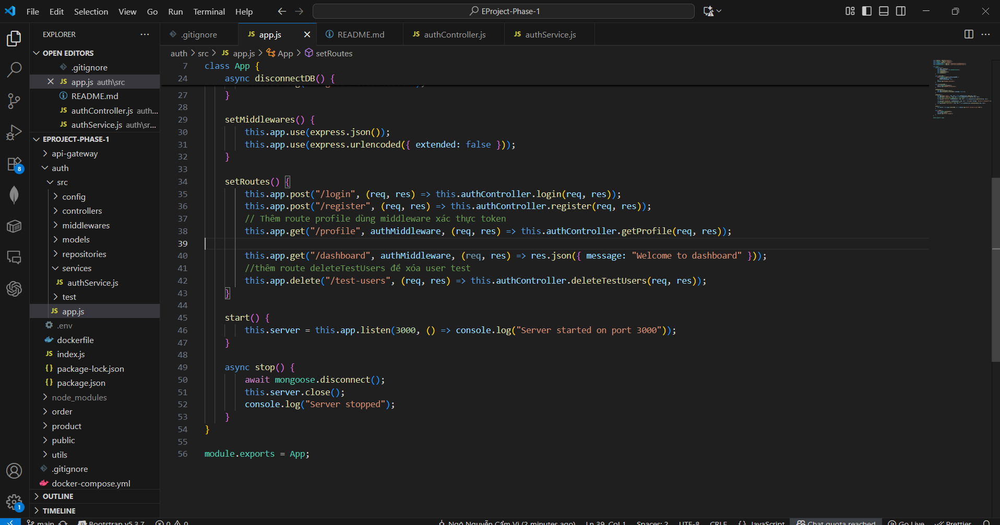
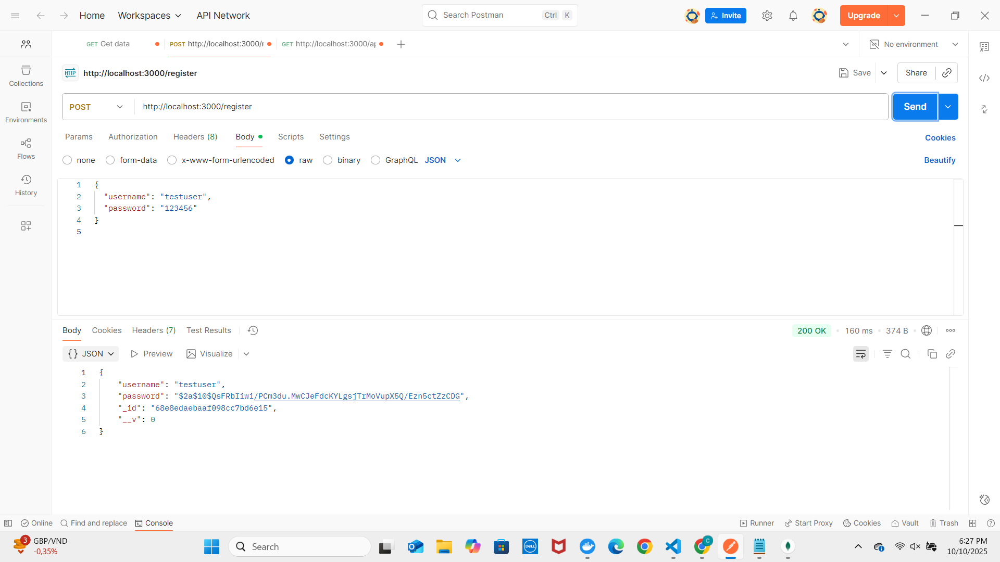
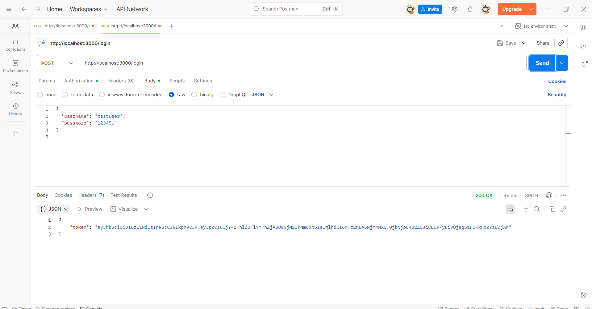
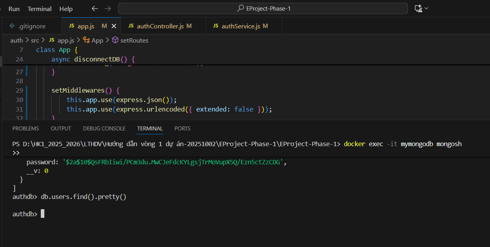

# 22716921-NgoNguyenCamVi-EProject

### thêm routes vào file app.js

### thêm hàm lấy user từ id vào file services/authService.js

## Chạy docker thành công
### trangthai_docker.png

### docker đã được kết nối với mongo

## Test trên Postman
### Đăng ký

### Đăng ký trùng

### data được lưu trên mongo

### Đăng nhập

### profile

### dashboard

### delete.png

### dữ liệu đã được xóa trên mongo
